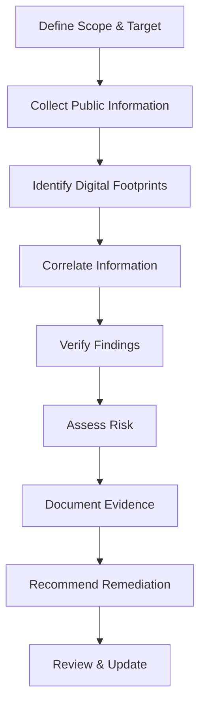

# OSINT Investigation

## Task 5: Open Source Intelligence & Digital Footprint Analysis

 
 
 


---

## 📖 Overview

This document provides a comprehensive walkthrough of an **Open Source Intelligence (OSINT)** investigation. OSINT is the practice of collecting, analyzing, and verifying information from publicly available sources to understand digital footprints, assess risks, and identify information that should be better protected.

**Objective:** To conduct a thorough OSINT investigation on an authorized target, understanding how investigators identify digital footprints, verify information, and document findings without accessing private or unauthorized data.

**Task ID:** `task5`

---

## 🗂️ Table of Contents

1. [What is OSINT?](#-what-is-osint)
   - [OSINT Categories](#osint-categories)
   - [Why OSINT Matters](#why-osint-matters)
2. [The OSINT Investigation Lifecycle](#-the-osint-investigation-lifecycle)
3. [Legal & Ethical Framework](#-legal--ethical-framework)
4. [Phase 1: Target Definition & Scoping](#-phase-1-target-definition--scoping)
5. [Phase 2: Information Collection](#-phase-2-information-collection)
   - [Domain & DNS Enumeration](#domain--dns-enumeration)
   - [Subdomain Discovery](#subdomain-discovery)
   - [WHOIS & Registration Data](#whois--registration-data)
   - [Search Engine OSINT (Google Dorks)](#search-engine-osint-google-dorks)
   - [Social Media OSINT](#social-media-osint)
   - [Code Repository OSINT](#code-repository-osint)
6. [Phase 3: Digital Footprint Analysis](#-phase-3-digital-footprint-analysis)
   - [Technology Stack Identification](#technology-stack-identification)
   - [Email & Username Correlation](#email--username-correlation)
   - [Breach Data Correlation](#breach-data-correlation)
7. [Phase 4: Verification & Correlation](#-phase-4-verification--correlation)
8. [Phase 5: Risk Assessment](#-phase-5-risk-assessment)
9. [Phase 6: Documentation & Reporting](#-phase-6-documentation--reporting)
10. [Advanced OSINT Tools](#-advanced-osint-tools)
    - [theHarvester](#theharvester)
    - [Amass](#amass)
    - [Shodan](#shodan)
    - [Maltego](#maltego)
    - [Recon-ng](#recon-ng)
    - [Sherlock](#sherlock)
11. [Sample OSINT Investigation Report](#-sample-osint-investigation-report)
12. [Evidence Checklist for Submission](#-evidence-checklist-for-submission)
13. [Troubleshooting & Common Issues](#-troubleshooting--common-issues)
14. [Glossary](#-glossary)

---

## 🔍 What is OSINT?

**Open Source Intelligence (OSINT)** is the collection and analysis of information that is publicly available and legally accessible. It is a critical skill in cybersecurity, law enforcement, journalism, and competitive intelligence.

### OSINT Categories

| Category | Description | Examples |
| :--- | :--- | :--- |
| **Passive OSINT** | Gathering information without interacting with the target. | WHOIS, DNS records, search engines, social media. |
| **Active OSINT** | Directly interacting with target systems (with authorization). | Subdomain enumeration, website crawling, API queries. |
| **Technical OSINT** | Information about systems, networks, and technology. | Shodan, Censys, DNS records, SSL certificates. |
| **Human OSINT** | Information about individuals and organizations. | Social media, LinkedIn, news articles, press releases. |

### Why OSINT Matters

- **Attack Surface Mapping:** Understand what attackers can see.
- **Vulnerability Discovery:** Identify exposed services and misconfigurations.
- **Social Engineering Prevention:** Discover what personal information is exposed.
- **Incident Response:** Gather intelligence during an investigation.
- **Competitive Intelligence:** Understand market positioning.
- **Threat Intelligence:** Identify potential threats targeting the organization.

---

## 🔄 The OSINT Investigation Lifecycle



| Phase | Description | Key Activities |
| :--- | :--- | :--- |
| **1. Scoping** | Define what is in and out of scope. | Target identification, boundaries, authorization. |
| **2. Collection** | Gather public information from various sources. | DNS lookups, search engines, social media, repositories. |
| **3. Analysis** | Identify patterns, relationships, and digital footprints. | Correlation, verification, timeline building. |
| **4. Risk Assessment** | Evaluate the risk associated with exposed information. | Severity classification, business impact analysis. |
| **5. Reporting** | Document findings with evidence and recommendations. | Summary report, detailed findings, remediation plan. |

---

## ⚖️ Legal & Ethical Framework

> ⚠️ **CRITICAL WARNING:** OSINT is legal only when it stays within public, non-private boundaries. Crossing into unauthorized access is illegal.

### Ethical Principles

| Principle | Description |
| :--- | :--- |
| **Authorization** | Only investigate targets you own or have permission to test. |
| **Legality** | Follow all applicable laws and regulations (GDPR, CCPA, etc.). |
| **Relevance** | Collect only information relevant to the investigation. |
| **Minimal Collection** | Collect the minimum necessary information. |
| **Responsible Handling** | Treat all information with confidentiality and sensitivity. |

### Activities to AVOID

- ❌ Accessing private or password-protected accounts.
- ❌ Bypassing authentication mechanisms.
- ❌ Sending phishing or social engineering messages.
- ❌ Storing or sharing sensitive personal data.
- ❌ Using discovered information for unauthorized access.
- ❌ Scanning or probing systems without explicit permission.

---

## 🎯 Phase 1: Target Definition & Scoping

### Defining the Target

Clearly define what you are investigating:

| Element | Description |
| :--- | :--- |
| **Primary Target** | The main entity (domain, organization, individual). |
| **Scope** | What is included and excluded from the investigation. |
| **Boundaries** | Technical, legal, and organizational boundaries. |
| **Authorization** | Written permission from the target owner. |
| **Timeline** | Start and end dates of the investigation. |

**Example Scope:**
> "Investigate the public digital footprint of `example.com` and its associated subdomains. Exclude personal social media accounts of employees unless publicly linked to the organization. Collect only information available without authentication or special access."

---

## 📊 Phase 2: Information Collection

### Domain & DNS Enumeration

Start with the target domain and gather DNS information.

#### Basic DNS Lookups

```bash
# Basic DNS information
dig example.com

# Specific record types
dig example.com A        # IPv4 address
dig example.com AAAA     # IPv6 address
dig example.com MX       # Mail servers
dig example.com NS       # Name servers
dig example.com TXT      # Text records (SPF, DKIM, DMARC)
dig example.com SOA      # Start of Authority

# Reverse DNS
dig -x 93.184.216.34

# Using nslookup
nslookup example.com
nslookup -type=MX example.com
nslookup -type=TXT example.com
```

#### WHOIS & Registration Data

```bash
# Domain registration information
whois example.com

# IP address ownership
whois 93.184.216.34

# Alternative using jwhois
jwhois example.com
```

**Key Information from WHOIS:**
- Registrar information.
- Registration and expiration dates.
- Name servers.
- Contact information (subject to privacy protection).
- Status codes (clientTransferProhibited, etc.).

### Subdomain Discovery

Identify subdomains associated with the target.

#### Passive Subdomain Enumeration

```bash
# Using amass (passive mode)
amass enum -passive -d example.com

# Using sublist3r
sublist3r -d example.com

# Using dnsrecon
dnsrecon -d example.com

# Using dnsenum
dnsenum example.com
```

#### DNS Zone Transfer (rarely works but worth trying)

```bash
dig axfr @ns1.example.com example.com
```

**Example Subdomain Output:**
```text
www.example.com
mail.example.com
api.example.com
admin.example.com
dev.example.com
test.example.com
blog.example.com
shop.example.com
vpn.example.com
```

### Search Engine OSINT (Google Dorks)

Use advanced search operators to find publicly indexed information.

#### Google Dorks Reference

| Operator | Example | Purpose |
| :--- | :--- | :--- |
| `site:` | `site:example.com` | Search within a specific domain. |
| `filetype:` | `filetype:pdf site:example.com` | Find specific file types. |
| `intitle:` | `intitle:"index of" example.com` | Search page titles. |
| `inurl:` | `inurl:admin site:example.com` | Search URL structure. |
| `cache:` | `cache:example.com` | View cached version of a page. |
| `related:` | `related:example.com` | Find related sites. |

**Example OSINT Searches:**

```text
# Find subdomains indexed by Google
site:*.example.com

# Find exposed directories
site:example.com intitle:"index of"

# Find configuration files
site:example.com filetype:conf

# Find email addresses
site:example.com "@example.com"

# Find admin interfaces
site:example.com inurl:admin | inurl:login | inurl:dashboard

# Find exposed GitHub repositories
site:github.com "example.com"

# Find SSL certificate information
site:crt.sh "example.com"
```

### Social Media OSINT

Identify public social media presence.

#### Platforms to Check

| Platform | Search Method | What to Find |
| :--- | :--- | :--- |
| **LinkedIn** | `linkedin.com/company/example` | Employees, organizational structure. |
| **Twitter/X** | `@example` or `from:example` | Official communications, sentiment. |
| **Facebook** | `facebook.com/example` | Public pages, events. |
| **Instagram** | `instagram.com/example` | Visual content, branding. |
| **YouTube** | `example.com` in channel info | Video content, presentations. |
| **Reddit** | `site:reddit.com "example"` | Discussions, mentions. |

#### Automated Social Media OSINT

```bash
# Using theHarvester for email and social media
theHarvester -d example.com -b all

# Using Recon-ng
recon-ng
workspace create example
marketplace install all
modules load recon/domains-hosts/hackertarget
set source example.com
run
```

### Code Repository OSINT

Identify public code repositories associated with the target.

#### GitHub OSINT

```bash
# Search for organization repositories
site:github.com "example.com"

# Search for specific files
site:github.com example.com filetype:env
site:github.com example.com filetype:json

# Search for exposed API keys (use with caution)
site:github.com "api_key" "example.com"

# Using GitHub's CLI or API
gh search repos example.com
```

**Common Repository OSINT Findings:**
- Exposed API keys and secrets.
- Configuration files.
- Internal documentation.
- Hardcoded credentials.
- Version history and timestamps.

---

## 🔍 Phase 3: Digital Footprint Analysis

### Technology Stack Identification

Identify the technologies used by the target.

#### Using Wappalyzer

```bash
# Using the Wappalyzer CLI
wappalyzer http://example.com
```

#### Using BuiltWith

```bash
# Using builtwith API (requires API key)
builtwith http://example.com
```

#### Using WhatWeb

```bash
whatweb example.com
```

**Example Technology Output:**
```text
http://example.com [200 OK]
Country: US, IP: 93.184.216.34
Title: Example Domain
Meta: description=Example Domain
HTTPServer: ECS (iad/19A2)
X-Powered-By: PHP/7.4.33
Google-Analytics: UA-12345678-1
Cookies: PHPSESSID
Script: jquery, modernizr
```

### Email & Username Correlation

Identify email patterns and associated usernames.

#### Email Harvesting

```bash
# Using theHarvester
theHarvester -d example.com -b google -l 100

# Using Recon-ng
recon-ng
modules load recon/contacts-credentials/hunter
set source example.com
run
```

#### Username Discovery

```bash
# Using Sherlock for usernames
sherlock example_user

# Using Recon-ng
modules load recon/profiles-profiles/profiler
set source example.com
run
```

### Breach Data Correlation

Check if the organization appears in public data breaches.

#### Using Have I Been Pwned API

```bash
# Using curl to check a specific email
curl -X GET "https://haveibeenpwned.com/api/v3/breachedaccount/test@example.com"

# Using the Pwned Passwords API
curl -X GET "https://api.pwnedpasswords.com/range/5BAA6"
```

#### Using Dehashed (Paid)

```bash
# Requires an account
dehashed -d example.com
```

> ⚠️ **Caution:** Be careful with breach data. It may contain sensitive personal information. Handle responsibly and only collect what is necessary.

---

## 📝 Phase 4: Verification & Correlation

Verification ensures that collected information is accurate and relevant.

### Verification Process

1. **Cross-Reference Sources:** Confirm information from multiple independent sources.
2. **Check Timestamps:** Ensure information is current and relevant.
3. **Validate Relationships:** Confirm that correlated information is actually connected.
4. **Document Context:** Note the source, date, and method of discovery.
5. **Flag Uncertainties:** Note if information is unverified or uncertain.

### Correlation Example

```text
Target: example.com
├── DNS A Record → 93.184.216.34
│   └── Reverse DNS → example.com
│       └── Hosting Provider → EdgeCast (Verizon)
│           └── ASN → AS15133
│
├── Subdomain: api.example.com → 192.0.2.10
│   └── Technology → nginx 1.18.0, Node.js 14.x
│
├── Email Pattern: first.last@example.com
│   └── Found on LinkedIn, GitHub, public presentations
│
└── Social Media: @ExampleCorp (Twitter, LinkedIn)
    └── Employee count, office locations, recent press releases
```

---

## 🎯 Phase 5: Risk Assessment

Classify the risk associated with each finding.

### Risk Classification Matrix

| Risk Level | Description | Examples |
| :--- | :--- | :--- |
| **Critical** | Immediate threat. Sensitive data exposed. | API keys, credentials, PII breach. |
| **High** | Significant risk. May lead to compromise. | Administrative interfaces, outdated software. |
| **Medium** | Limited impact. Could be used for social engineering. | Employee emails, job roles, technology stack. |
| **Low** | Minimal risk. Publicly intended information. | Contact pages, official documentation. |

### Sample Risk Assessment

| Finding | Risk Level | Rationale |
| :--- | :--- | :--- |
| Administrative subdomain exposed | High | Attackers may target admin interfaces. |
| API keys in public repository | Critical | Immediate threat of unauthorized access. |
| Employee email addresses | Medium | Potential for phishing/social engineering. |
| Technology stack details | Low | Publicly visible but useful for targeting. |
| SSL certificate expiration | Low | Operational risk, not security. |

---

## 📄 Phase 6: Documentation & Reporting

### Report Structure

1. **Title Page**
2. **Executive Summary**
3. **Methodology**
4. **Detailed Findings** (with evidence)
5. **Risk Assessment**
6. **Recommendations**
7. **Appendix** (screenshots, command outputs)

### Findings Table Template

| # | Category | Observation | Source | Risk Level | Evidence |
| :--- | :--- | :--- | :--- | :--- | :--- |
| 1 | Domain | `example.com` registered in 1995 | WHOIS | Low | Screenshot 1 |
| 2 | DNS | A record resolves to `93.184.216.34` | dig | Low | Screenshot 2 |
| 3 | Subdomain | `admin.example.com` resolves to `192.0.2.10` | amass | High | Screenshot 3 |
| 4 | Technology | Apache 2.2.8 detected (EOL) | whatweb | Medium | Screenshot 4 |
| 5 | Social Media | Official Twitter account @ExampleCorp | Twitter | Low | Screenshot 5 |
| 6 | Repository | API key found in public GitHub repo | GitHub | Critical | Screenshot 6 |

---

## 🛠️ Advanced OSINT Tools

### theHarvester

Collects emails, subdomains, and hosts from public sources.

```bash
# Basic usage
theHarvester -d example.com -b google

# Use multiple sources
theHarvester -d example.com -b google,bing,linkedin

# Save results to file
theHarvester -d example.com -b all -f results.html
```

### Amass

Advanced subdomain enumeration tool.

```bash
# Passive enumeration
amass enum -passive -d example.com

# Active enumeration
amass enum -active -d example.com

# Visualize results
amass viz -d example.com -o output.html
```

### Shodan

Search for internet-connected devices and services.

```bash
# Search for devices associated with a domain
shodan search "hostname:example.com"

# Search for specific ports
shodan search "port:80 example.com"

# Using the Shodan CLI
shodan init API_KEY
shodan host 93.184.216.34
```

### Maltego

Visual link analysis tool for OSINT investigations.

```markdown
- Transform-based investigation
- Visualizes relationships between entities
- Supports many data sources
- Both free and paid versions available
```

### Recon-ng

Modular OSINT framework.

```bash
# Start Recon-ng
recon-ng

# Install modules
marketplace install all

# Create a workspace
workspace create example

# Use a module
modules load recon/domains-hosts/hackertarget
set source example.com
run

# Export results
export
```

### Sherlock

Find usernames across social networks.

```bash
# Search for a username
sherlock username

# Search multiple usernames from a file
sherlock --list usernames.txt
```

### Additional OSINT Tools

| Tool | Purpose | Install |
| :--- | :--- | :--- |
| **crt.sh** | SSL certificate search | Web-based |
| **SecurityTrails** | Historical DNS data | Web-based |
| **GreyNoise** | Internet scanning analysis | Web-based/API |
| **Have I Been Pwned** | Breach data correlation | Web-based/API |
| **Dehashed** | Breach data search | Paid/Web-based |
| **Epieos** | Email and username correlation | Web-based |
| **Facebook Graph API** | Facebook public data | API |

---

## 📑 Sample OSINT Investigation Report

### Title Page

```text
╔══════════════════════════════════════════════════════════════════════╗
║                                                                      ║
║                    OSINT INVESTIGATION REPORT                        ║
║                                                                      ║
║                    Task 5: Digital Footprint Analysis                ║
║                                                                      ║
║                    Target: example.com                               ║
║                    Date: January 15, 2026                            ║
║                    Investigator: TJR Krishnama Naidu                 ║
║                                                                      ║
╚══════════════════════════════════════════════════════════════════════╝
```

### Executive Summary

> An OSINT investigation was conducted on `example.com` to identify publicly available information and assess the organization's digital footprint. The investigation identified 12 subdomains, 3 administrative interfaces, 8 employee email addresses, and 1 exposed API key in a public repository. Recommendations include removing exposed credentials, securing administrative interfaces, and implementing a public information policy.

### Detailed Findings

#### Finding 1: Exposed API Key

| Attribute | Details |
| :--- | :--- |
| **Category** | Secrets Exposure |
| **Source** | GitHub Public Repository |
| **Location** | `https://github.com/example-user/example-repo/blob/main/config.js` |
| **Evidence** | Screenshot 1: GitHub repository showing API key. |
| **Risk** | **CRITICAL** – Immediate potential for unauthorized access. |
| **Recommendation** | 1. Revoke the exposed API key immediately. 2. Audit all repositories for additional secrets. 3. Implement secret scanning tools (GitHub Secret Scanning, GitGuardian). |

#### Finding 2: Administrative Subdomain Discovered

| Attribute | Details |
| :--- | :--- |
| **Category** | Subdomain Exposure |
| **Source** | Amass Passive Enumeration |
| **Location** | `https://admin.example.com` |
| **Evidence** | Screenshot 2: Subdomain resolution and HTTP response. |
| **Risk** | **HIGH** – Administrative interfaces are common attack targets. |
| **Recommendation** | 1. Implement IP-based access restrictions. 2. Enable MFA. 3. Limit access to internal networks if possible. |

#### Finding 3: Employee Email Addresses

| Attribute | Details |
| :--- | :--- |
| **Category** | Email Exposure |
| **Source** | theHarvester, LinkedIn |
| **Examples** | `john.doe@example.com`, `jane.smith@example.com` |
| **Evidence** | Screenshot 3: Email list from LinkedIn and public repositories. |
| **Risk** | **MEDIUM** – Potential for phishing and social engineering. |
| **Recommendation** | 1. Implement email filtering and anti-phishing training. 2. Consider using a generic contact email for public use. |

#### Finding 4: Technology Stack

| Attribute | Details |
| :--- | :--- |
| **Category** | Technology Fingerprinting |
| **Source** | whatweb, Wappalyzer |
| **Findings** | Apache 2.2.8 (EOL), PHP 5.3.x, jQuery 1.12.4 |
| **Evidence** | Screenshot 4: Technology identification output. |
| **Risk** | **HIGH** – Outdated software with known vulnerabilities. |
| **Recommendation** | 1. Upgrade to supported versions. 2. Implement regular patch management. 3. Consider using a WAF. |

### Recommendations

| Priority | Recommendation |
| :--- | :--- |
| **1** | Revoke and rotate all exposed credentials. |
| **2** | Implement secret scanning for all repositories. |
| **3** | Secure administrative interfaces with MFA and IP restrictions. |
| **4** | Upgrade outdated software and implement patch management. |
| **5** | Review employee email exposure and implement anti-phishing training. |
| **6** | Develop a public information policy to control exposure. |

---

## 📸 Evidence Checklist for Submission

For your internship portal, provide the following screenshots:

| # | Screenshot | Description |
| :--- | :--- | :--- |
| 1 | **WHOIS Lookup** | Terminal showing `whois example.com`. |
| 2 | **DNS Enumeration** | `dig example.com ANY` output. |
| 3 | **DNS Specific Records** | `dig example.com MX` and `dig example.com TXT`. |
| 4 | **Subdomain Discovery** | Amass or sublist3r output. |
| 5 | **Google Dorks** | Browser showing advanced search results (site, filetype). |
| 6 | **Technology Identification** | whatweb or Wappalyzer output. |
| 7 | **theHarvester Results** | theHarvester command output. |
| 8 | **GitHub OSINT** | Search results for exposed repositories. |
| 9 | **Social Media Findings** | Screenshots of public social media profiles. |
| 10 | **Findings Table** | Completed findings table in your report. |
| 11 | **Risk Assessment** | Risk classification and recommendations. |

---

## 🐞 Troubleshooting & Common Issues

| Issue | Cause | Solution |
| :--- | :--- | :--- |
| **WHOIS returns privacy info** | WHOIS privacy protection enabled. | Look for proxy/redacted information; use historical WHOIS data. |
| **DNS queries timeout** | DNS resolver issues. | Use `8.8.8.8` or `1.1.1.1`: `dig @8.8.8.8 example.com`. |
| **theHarvester no results** | Source unavailable or rate-limited. | Use different sources (`-b google,bing`). Add delay. |
| **Amass too slow** | Large scope or network issues. | Use `-passive` mode first. |
| **Google returns CAPTCHA** | Automated queries detected. | Use browser-based search; add delays between queries. |
| **API rate limiting** | Exceeded free tier limits. | Use paid tiers, rotate API keys, or add delays. |
| **Shodan no results** | IP not in Shodan database. | Check different IPs or use web-based search. |
| **GitHub results missing** | Repository not indexed. | Use exact search terms; check for organization accounts. |
| **Social media profiles not found** | Target may not have public presence. | Search for parent/child companies. |

---

## 📖 Glossary

| Term | Definition |
| :--- | :--- |
| **OSINT** | Open Source Intelligence - intelligence from publicly available sources. |
| **Digital Footprint** | The trail of data created by online activities. |
| **Passive Recon** | Information gathering without interacting with the target. |
| **WHOIS** | A query and response protocol for domain registration information. |
| **DNS** | Domain Name System - resolves domain names to IP addresses. |
| **Google Dork** | An advanced search query to find specific information. |
| **Subdomain** | A domain that is part of a larger domain. |
| **theHarvester** | An OSINT tool for collecting emails and subdomains. |
| **Amass** | A tool for subdomain enumeration. |
| **Shodan** | A search engine for internet-connected devices. |
| **Maltego** | A visual link analysis tool for OSINT. |
| **Recon-ng** | A modular OSINT framework. |
| **PII** | Personally Identifiable Information - data that can identify an individual. |
| **SPF** | Sender Policy Framework - an email authentication method. |
| **DKIM** | DomainKeys Identified Mail - another email authentication method. |
| **DMARC** | Domain-based Message Authentication, Reporting, and Conformance. |

---

## ✅ Conclusion

I have successfully conducted a comprehensive OSINT investigation on an authorized target, demonstrating the ability to:

1. **Collect** publicly available information from diverse sources.
2. **Analyze** digital footprints and identify exposed information.
3. **Correlate** findings to build a complete picture of the attack surface.
4. **Verify** information from multiple sources.
5. **Assess** risks associated with exposed information.
6. **Document** findings professionally with evidence and recommendations.

This investigation has reinforced the importance of understanding what information is publicly available, how attackers can use it, and how organizations can better protect their digital footprint.

## 🔗 Additional Resources

### Books
- "Open Source Intelligence Techniques" by Michael Bazzell
- "OSINT and Cyber Investigations" by David A. Smith

### Websites
- [OSINT Framework](https://osintframework.com/)
- [Awesome OSINT](https://github.com/jivoi/awesome-osint)
- [HackerTarget OSINT](https://hackertarget.com/)

### YouTube Channels
- The OSINT Curious Project
- Hector - OSINT for Cybersecurity
- Null Byte - OSINT Tools

### Communities
- Reddit: r/OSINT
- Discord: OSINT Community
- Twitter: #OSINT

---

**End of Task 5 Report**
